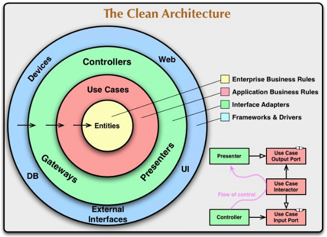
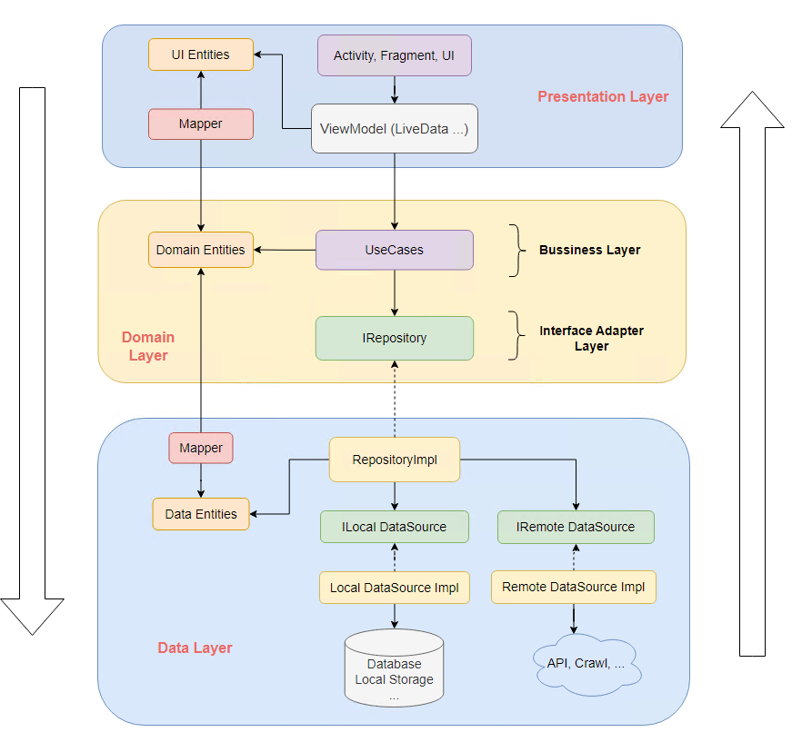
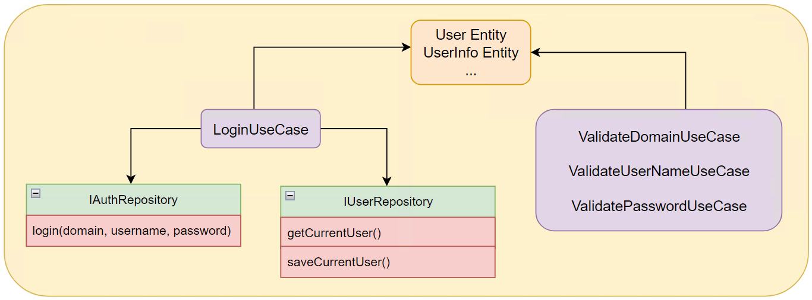
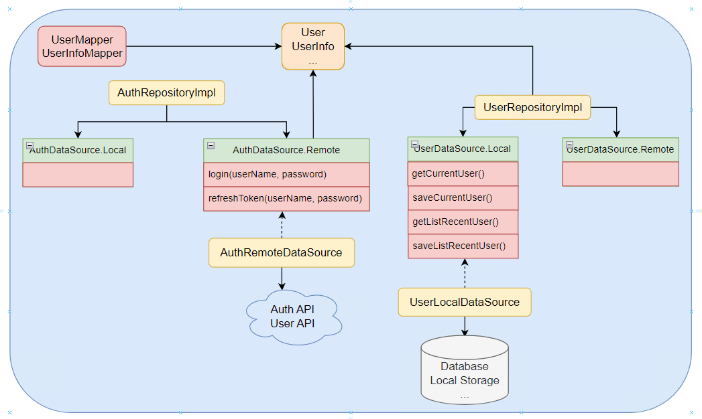

# Misa App Follow Clean Architecture

## 1. Author

- `Robert Cecil Martin`, colloquially called `Uncle Bob`, is an American software engineer, instructor, and author.
- `Martin` has authored many popular books and magazine articles such as `clean code`, `clean architecture ...`

## 2. SOLID

- ### SRP - `Single Responsibility Principle`
    - A module should be responsible to `one` and `only one` actor
- ### OCP - `The Open-Closed Principle`
    - A software artifact should be `open for extension` but `closed for modification`.
- ### LSP - `The Liskov Substitution Principle`
    - `Objects of a superclass` should be `replaceable` with `objects of its subclasses` **without** breaking the application.
- ### ISP - `The Interface Segregation Principle`
    - clients should `not` be forced to depend on interfaces that they don’t use.
- ### DIP - `The Dependency Inversion Principle`
    - `High-level modules` should `not` depend upon `low level-modules`. Both should depend upon `abstractions`

## 3. Clean Architecture



- ### Overview
    - Clean Architecture chia hệ thống thành 3 tầng riêng biệt với các chức năng mà mức độ phụ thuộc, quan trọng khác
      nhau: `Presentation Layer`, `Data Layer`, `Domain layer`
    - Mức độ `phụ thuộc` và `quan trọng` của từng lớp sẽ tăng dần theo chiều mũi tên từ bên ngoài vào trong
    - Các tầng bên trong sẽ không biết tới tầng bên ngoài và không phụ thuộc vào tầng bên ngoài
    - Tầng `Domain` là tầng quan trọng nhất và bao gồm 3 vòng tròn màu `vàng`, `đỏ`, `xanh lá`
    - Tầng `Data` và tầng `Presentation` thuộc vòng tròn ngoài cùng
- ### Domain Layer
    - Tầng này là tầng `quan trọng nhất` của app, tầng này sẽ thể hiện được `nghiệp vụ - bussiness`, giá trị cốt lõi của app
    - Tầng Domain sẽ bao gồm 3 lớp: Lớp `entities`, lớp `uscases` và lớp `interface adapter`
    - ### Entity Layer (màu vàng)
        - Lớp này sẽ bao gồm các class đối tượng chính của app (ví dụ: order, invoice, dog, cat, ....)
        - Các đối tượng ở lớp này chính là các `core entity` được sử dụng xuyên suốt toàn app
    - ### Usecase Layer (màu đỏ)
        - Các `usecase` chính là các `chức năng nghiệp vụ` của app (tuân thủ `SRP` trong `SOLID`)
            - ví dụ tính tiền, tính thuế, tạo order, thanh toán, ...
        - Mỗi `usecase` chỉ được thể hiện `một chức năng duy nhất`, có thể có thêm các hàm xử lý để tách nhỏ việc xử lý trong usecase
          nhưng các hàm này phải được `đóng gói (private)` và hàm được thể hiện ra ngoài là hàm duy nhất thể hiện chức năng đó
    - ### Interface Adapter Layer (màu xanh)
        - Tầng này bao gồm các `interface (protocol)` có vai trò giao tiếp giữa tầng `Domain` với các tầng bên ngoài. Việc giao tiếp
          sẽ thông qua `abstract` chứ không phải qua `implementation`
        - Tầng này sẽ giúp việc giảm, tránh sự phụ thuộc giữa các tầng (tuân thủ `DIP` trong `SOLID`)
- ### Data Layer
    - Tầng này sẽ nằm ở vòng tròn màu xanh dương (vòng tròn ngoài cùng) ngang hàng với tầng UI (Presentation)
    - Tầng này sẽ chỉ thực hiện các nhiệm vụ:
        - `Lấy` dữ liệu (từ api, database, local storage, crawl data, ăn cắp data, ...)
        - `Lưu` dữ diệu
        - `Chuyển đổi` dữ liệu từ response trả về sang đúng định dạng entity của Domain (thông qua các lớp Mapper)
- ### Presentation Layer
    - Tầng này sẽ nằm ở vòng tròn màu xanh dương (vòng tròn ngoài cùng) ngang hàng với tầng Data
    - Tầng này sẽ thực hiện các nhiệm vụ:
        - `Hiển thị` dữ liệu lên UI
        - `Xử lý` sự kện của người dùng (người dùng ấn, chạm, kéo, thả, chửi ...)
        - `Sử dụng Usecase` để xử lý nghiệp vụ
        - Ở tầng này ta có thể sử dụng kết hợp mô hình `MVP`, `MVVM` hoặc `MVC` để code được gọn gàng hơn

## 4. App Flow



- `kiến trúc app` tuân theo `clean architecture` cũng sẽ có `3 module`(hoặc folder) tương ứng với 3 tầng `presentation`,`domain`
  ,`data`

- `Mũi tên nét liền`: thể hiện quan hệ phụ thuộc giữa 2 class (class A dử dụng class B -> class A phụ thuộc vào class B)

- `Mũi tên nét đứt`: thể hiện quan hệ phụ thuộc kế thừa giữa 2 class (class A extend/implement class B)

- ### Presentation Layer
    - `Activity, Fragment, UI`:
        - UI, giao diện của app
    - `ViewModel`:
        - Xử lý sự kiện, event của người dùng
        - Gọi tới UseCase để xử lý các tác vụ bussiness
        - Tầng UI sẽ phải cung cấp các Repository mà UseCase cần thông qua hàm constructor của UseCase (tuân thủ Dependency
          Injection)
    - `Mapper`:
        - các class `mapper` có vai trò `chuyển đổi` các entity giữa 2 tầng domain và presentation
    - `UI Entities`:
        - Các Entity, Model của tầng UI.
        - Thông thường tầng UI sẽ dùng luôn các entities của tầng Domain, nhưng một số
          trường hợp sẽ cần thêm các trường, các cờ để xử lý riêng cho UI thì cần tạo ra các entity tương ứng ở tầng UI rồi dùng các
          lớp
          Mapper để chuyển lại về entities cho tầng domain
        - Có thể linh hoạt `dùng entity của domain` hoặc `tạo entity mới` rồi dùng mapper để chuyển đổi hoặc `tạo entity con` kế thừa
          entity của domain

- ### Domain Layer
    - `Domain entities`:
        - Các entities core của app, thể hiện rõ các đối tượng đặc trưng cho nghiệp vụ của chương trình
    - `UseCase`:
        - Các lớp chức năng thể hiện rõ một chức năng, một usecase cụ thể đặc trưng cho nghiệp vụ của chương trình
        - 1 UseCase không được gọi tới UseCase khác
        - 1 UseCase có thể có các hàm private để tách nhỏ hàm nhưng chỉ được thể hiện ra ngoài 1 hàm duy nhất đặc trưng cho chức năng
          cụ thể của UseCase
    - `IRepository`:
        - Khi UseCase thực hiện xử lý bussiness thì sẽ cần dùng tới Repository để thực hiện việc thao tác với dữ liệu.
        - UseCase phụ thuộc vào Repository -> phụ thuộc vào tầng Data -> phá vỡ rule của Clean Architecture là tầng Domain sẽ
          không phụ thuộc và không biết tới tầng Data.
        - Để giải quyết vấn đề này ta sẽ áp dụng `DIV (Dependency Inversion Principle)`.
            - Ở tầng Domain sẽ tạo ra các `Repository
              Interface` và UseCase sẽ dùng (phụ thuộc và các `IRepository` này).
            - Sau đó ở tầng Data thì các `RepositoryImpl` sẽ implement lại
              các IRepository đó ~
            - thay vì `UseCase` phụ thuộc vào `Repository` thì `cả 2` sẽ cùng phụ thuộc vào `IRepository`
        - Các RepositoryImpl sẽ được `Inject` vào `UseCase` và thông qua `hàm tạo (constructor)` của UseCase ở trên tầng UI (áp dụng
          `Dependency Injection`)

- ### Data Layer
    - `RepositoryImpl`:
        - Kế thừa lại Repository của tầng Domain, Repo này có tác dụng lấy và lưu dữ liệu, Repo sẽ quyết định cần lấy dữ liệu
          ở `Local` hay là `Remote`
    - `Data Source`:
        - Nguồn dữ liệu `local` trong máy. Có thể là `Database`, `File`, `SharePreferences`, dữ liệu trong `object` toàn cục (static)
          ...
        - Nguồn dữ liệu `Remote`: Lấy từ `API`, `socket`, `Crawl từ Web`, ...
    - `Interface Data Source`:
        - Để `loại bỏ sự phụ thuộc` giữa `Repo` và `Data source`, việc thay thế các DataSource từ các nguồn khác nhau
          sẽ `không ảnh hưởng` tới `Repo` và `không cần sửa lại` các Repo

## 5. How to complete a PBI follow Base Misa Clean Architecture?

- Khi thi công một PBI ta sẽ thi công theo thứ tự: `Domain Layer` --> `Data Layer` --> `UI Layer`
- ### Domain Layer

  

- **Step 1**: Tạo các class tương ứng với các `entity` cần thiết của PBI
    - Ở tầng này các `entity` sẽ gọi chung là `model` để phân biệt với tầng `Data`
    - Các `model` này sẽ `implement` chung một `interface Model` để phục vụ cho việc `mapper` giữa các tầng sau này
    - VD:
       ```kotlin
        class UserModel : Model{
           var domain: String? = null
           var username: String? = null
           var password: String? = null
           var userInfo: UserInfoModel? = null
           var branchList: List<BranchModel>? = null
           var workingBranch: BranchModel? = null
        }
  
        class UserInfoModel: Model {
           var employeeID: String? = null
           var fullName:  String? = null
           var email: String? = null
           var listRole: String? = null
           var avatarURL: String? = null
        }
      ```
- **Step 2**: Tạo các `UseCase` tương ứng với các chức năng, nghiệp vụ cần thiết của PBI
    - Các `UseCase` sẽ extend từ một số `BaseUseCase` đã được định nghĩa trước như:
        ```Kotlin
      // UseCase không có Param, kiểu trả về T
      abstract class NoParamUseCase<T> : BaseUseCase() {
          abstract suspend operator fun invoke(): T
      }
      // UseCase có Param, kiểu trả về T
      abstract class ParamUseCase<in Params, T> : BaseUseCase() {
         abstract suspend operator fun invoke(params: Params): T
      }
      // UseCase không có Param, có Response kiểu trả về Response<T>
      abstract class NoParamResponseUseCase<T> : BaseUseCase() {
         abstract suspend operator fun invoke(): MSResponse<T>
      }
      // UseCase có Param, có Response kiểu trả về Response<T>
      abstract class ParamResponseUseCase<in Params, T> : BaseUseCase() {
         abstract suspend operator fun invoke(params: Params): MSResponse<T>
      }
      ```
    - VD: Tạo các UseCase: `LoginUsecase`, `ValidateDomainUseCase`, `ValidateUserNameUseCase`, `ValidatePasswordUseCase`
      ```kotlin
      // ví dụ về một uscase login
      // các repo sẽ được 'Inject' và UseCase qua hàm tạo
      // chức năng chính của UseCase sẽ được thể hiện qua hàm 'Invoke'
      class LoginUsecase(
          private val authRepository: IAuthRepository,
          private val userRepository: IUserRepository,
      ) : ParamResponseUseCase<LoginParam, LoginResult>() {
         override suspend fun invoke(params: LoginParam): MSResponse<LoginResult> {
            // ...
         }
         // private func ...
      }
      // ...
      ```

    - Khi thi công `UseCase` nếu cần phải `lấy dữ liệu` hoặc `lưu dữ liệu` thì sẽ tạo ra các file `Interface IRepository` có các hàm tương
      ứng với việc lấy/lưu dữ liệu (chưa cần quan tâm tới `implement` của các Repo này ở bước hiện tại)
        - VD với `LoginUsecase` thì sẽ cần tới việc call service đăng nhập, lấy thông tin user, lưu cache thông tin user
          -> tạo ra 2 file `IUserRepository` và `IAuthRepository` để đảm nhiệm các nhiệm vụ trên
          ```kotlin
          interface IAuthRepository {
             suspend fun login(domain: String, username: String,password: String): MSResponse<CommonInfoMobileManagerDataModel>
             // ...
          }
          interface IUserRepository {
             suspend fun getCurrentUser(): UserModel?
             suspend fun saveCurrentUser(user: UserModel): Boolean
          }
          ```
- ### Data Layer
  
    - Step 1: Thi công các `entities` tương ứng với các `models` ở tầng `domain` và các class `mapper` để chuyển đổi qua lại giữa
     `entity` và `model`
        - Đối với các `entity` mà cần lưu trong `database` thì cần tạo lớp `entity database` kế thừa từ `interface DatabaseObject`
          - Annotation `@ColumnInfo` - tương ứng với `tên cột` trong `database`
            - nếu là `primaryKey` thì cần mark thêm trong annotation này `primaryKey = true`
            - nếu trường `không tương ứng` với cột nào trong database thì `không đánh annotation` này
          - Annotation `@SerializedName` - tương ứng với tên trường để parse/convert từ JSON
          ```kotlin
          open class ExampleEntity : DatabaseObject {
              
              @ColumnInfo("EntityID", isPrimaryKey = true)
              @SerializedName("EntityID")
              var entityID: String? = null
            
              @ColumnInfo("EntityColumn")
              @SerializedName("EntityColumn")
              var entityColumn: String? = null
          
              @SerializedName("EntityNonColumn")
              var entityNonColumn: String? = null
          
              // các action ADD, EDIT, DELETE sẽ được set tương ứng khi ta muốn thêm, sửa, xóa dữ liệu khi thao tác với hàm saveData
              fun getAction(): EDBAction {
              }
              
              fun setAction(action: EDBAction) {
              }
          }
          ```
        - Tiếp tới là tạo các `entity` - kế thừa `entity database` (nếu có) và `implement` interface `ModelEntity` để phục vụ việc `mapper`
          - Annotiation `@Entity` sẽ đánh dấu `tên bảng` trong `database` của entity này
            - isTemporary: đánh dấu có phải `object tạm` chỉ dùng để query không?
          - Annotiation `@TemporaryColumn` sẽ đánh dấu đây là `cột tạm` - `không có trong database` nhưng khi query ra kết quả sẽ có do việc `join, map, ..` trong câu query
          ```kotlin
             @Entity(tableName = "ExampleTable")
             class Example : ExampleEntity(), ModelEntity {
          
                @TemporaryColumn(name = "TempColumn")
                @SerializedName("TempColumn")
                var tempColumn: String? = null
          
             }
          ```
      - VD về enities `User` va `UserInfo` cho tầng Data (do 2 entity này không có trong database nên sẽ không cần tạo `database entity `và `mark Anotation`)
      ```kotlin
      // interface base mapper để convert entites giữa 2 tầng data và domain
      interface EntityMapper<DO : DomainEntity, DA : DataEntity> {
         fun mapToDomain(dataEntity: DA): DO
         fun mapToData(domainEntity: DO): DA
      }
      ```
        - ở tần data do cần `lưu`, `parse` dữ liệu nên sẽ cần `Serialize`
      ```kotlin
      // 
      data class User(
         @SerializedName("Domain")
         var domain: String? = null,
         @SerializedName("Username")
         var username: String? = null,
         @SerializedName("Password")
         var password: String? = null,
         @SerializedName("UserInfo")
         var userInfo: UserInfo? = null,
         @SerializedName("BranchList")
         var branchList: List<Branch>? = null,
         @SerializedName("WorkingBranch")
         var workingBranch: Branch? = null
      ) : DataEntity
      
      data class UserInfo(
         @SerializedName("EmployeeID")
         var employeeID: String? = null,
         @SerializedName("FullName")
         var fullName: String? = null,
         @SerializedName("Email")
         var email: String? = null,
         @SerializedName("ListRole")
         var listRole: String? = null,
         @SerializedName("AvartarURL")
         var avatarURL: String? = null,
      ) : DataEntity
      ```
    - Step 2: `Implement` các `Interface Repository` của tầng `domain` thành các class `RepositoryImpl`
        - Khi implement các Repository thì ta sẽ cần tới các `data source` để lấy và lưu dữ liệu. Khi đó sẽ cần tạo ra các file
          interface `ILocalDataSource` và `IRemoteDataSource` với các hàm lấy dữ liệu tương ứng (chưa cần quan tâm tới
          việc `implement` vội)
        - VD PBI Login:
          ```kotlin
          interface UserDatasource {
              interface Remote {}
              interface Local {
                  suspend fun getCurrentUser(): User?
                  suspend fun saveCurrentUser(user: User, resetDataIfNeed: () -> Unit): Boolean
                  suspend fun getListRecentUser(): List<User>
                  suspend fun saveListRecentUser(recentUsers: List<User>): Boolean
              }
          }
          
          interface AuthDatasource {
              interface Remote {
                    suspend fun login(username: String, password: String): MSServiceResponse
                    fun refreshToken(userName: String, password: String): Call<MSServiceResponse>
              }
              interface Local {}
          }
          ```
    - Step 3: `Implement` các file `ILocalDataSource` và `IRemoteDataSource` để thực hiện việc lấy dữ liệu và lưu dữ liệu. 1
      file `ILocalDataSource` có thể có nhiều phiên bản `Implement` với các cơ chế khác nhau (VD: 1 file lưu bằng Database, 1 file
      lưu bằng cache, ...)
- ### Presentation Layer
    - Step 1: Xâu dựng UI, vẽ các file XML, binding với Java/Kotlin
    - Step 2: Xây dựng các ViewModel để xử lý logic
        - Các ViewModel sẽ sử dụng các UseCase để xử lý nghiệp vụ
        - Có thể dùng các entities của domain hoặc tạo mới rồi mapper tùy ý